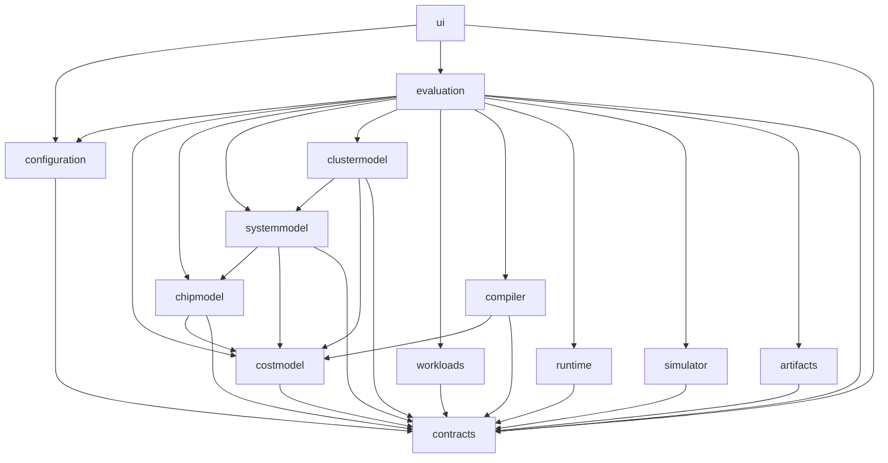
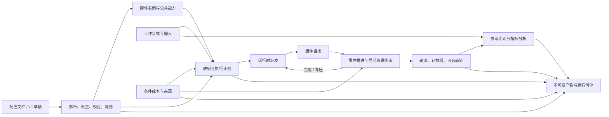
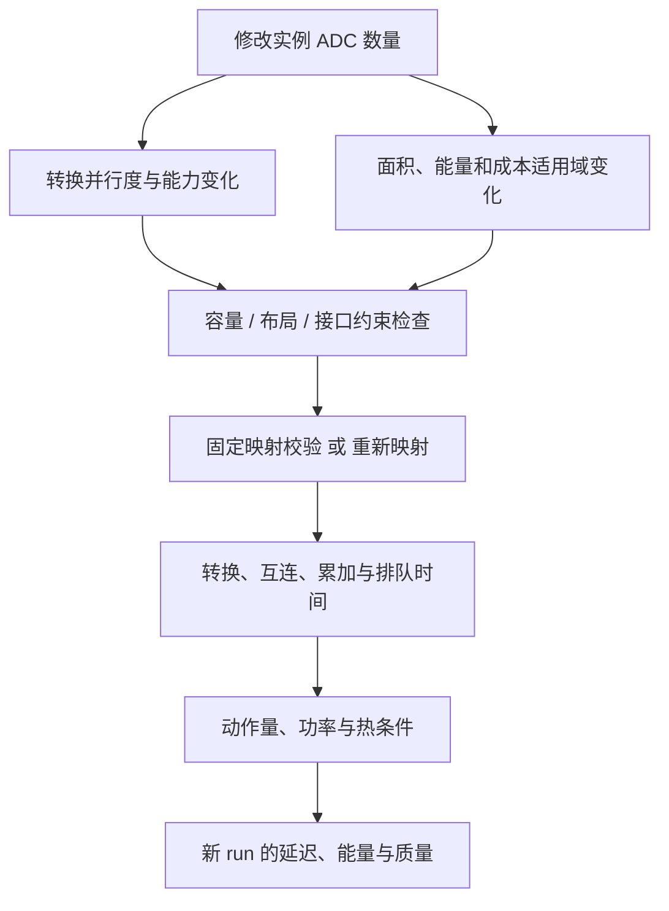

# 架构关系图

## 1 公开接口依赖

箭头 A → B 表示 A 可以依赖 B 的公开接口。此图和 `modules.json` 描述代码边界；运行消息可以双向交换。

```mermaid
flowchart TD
    UI[ui] --> CFG[configuration]
    UI --> E[evaluation]
    E --> CFG
    E --> COST[costmodel]
    E --> CHIP[chipmodel]
    E --> SYS[systemmodel]
    E --> CL[clustermodel]
    E --> W[workloads]
    E --> CP[compiler]
    E --> RT[runtime]
    E --> SIM[simulator]
    E --> A[artifacts]
    CL --> SYS
    SYS --> CHIP
    CL --> COST
    SYS --> COST
    CHIP --> COST
    CP --> COST
    CFG --> C[contracts]
    COST --> C
    CHIP --> C
    SYS --> C
    CL --> C
    W --> C
    CP --> C
    RT --> C
    SIM --> C
    A --> C
    E --> C
    UI --> C
```

## 2 一次实验的信息交换

```mermaid
flowchart LR
    F[配置文件 / UI 草稿] --> R[解析、派生、校验、冻结]
    R --> H[硬件实例与公共能力]
    R --> P[映射与执行计划]
    W[工作负载与输入] --> P
    H --> P
    C[条件成本与来源] --> P
    P --> RT[运行时派发]
    RT --> Q[组件请求]
    Q --> S[事件推进与局部资源状态]
    C --> S
    S -->|完成 / 背压| RT
    S --> O[输出、计数器、可选轨迹]
    O --> V[参考比对与指标分析]
    W --> V
    R --> A[不可变产物与运行清单]
    P --> A
    C --> A
    O --> A
    V --> A
```

## 3 参数改动的解释链

```mermaid
flowchart TD
    X[修改实例 ADC 数量] --> D[转换并行度与能力变化]
    X --> C[面积、能量和成本适用域变化]
    D --> K[容量 / 布局 / 接口约束检查]
    C --> K
    K --> P[固定映射校验 或 重新映射]
    P --> T[转换、互连、累加与排队时间]
    T --> E[动作量、功率与热条件]
    E --> R[新 run 的延迟、能量与质量]
```

热反馈若启用，在事件/时间模型中计算；上图只是设计解释链，不把反馈当静态字段递归。
